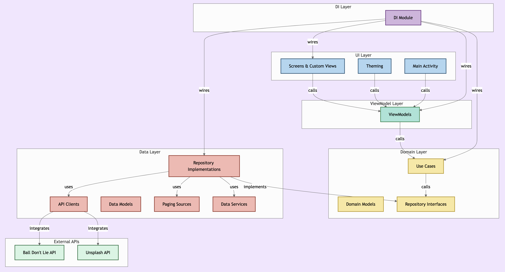

# NBA App
*A clean and structured Android application for exploring NBA players and their information, built using modern Android development practices.*

## Features:
- **Jetpack Compose** for UI
- **Kotlin** as the main programming language
- **MVVM architecture** for clean code separation
- **Kotlin Coroutines & Flow** for asynchronous programming
- **Retrofit & OkHttp** for API calls
- **Navigation Compose** with type-safe routes for seamless screen transitions
- **Room** for offline caching with instant offline response
- **Material 3 Design** for a modern look and feel
- **Paging 3** with RemoteMediator for efficient data loading and pagination
- **Glide** for image loading
- **Dark Mode & Light Mode** support
- **Dependency Injection with Koin**
- **R8** code minification and resource shrinking
- **Offline-first architecture** with ConnectivityObserver for instant cached data when offline
- **OkHttp disk cache** for HTTP response caching
- **Rate limit handling** with automatic retry and retry-after header support
- **Network security config** enforcing HTTPS-only traffic
- **Lifecycle-aware state collection** with collectAsStateWithLifecycle
- **Kover** for code coverage reporting

## Architecture:
- **Clean Architecture** with domain layer exceptions (DataException sealed class)
- **Cache-first strategy** in repositories — serves cached data instantly, falls back to API
- **Domain-driven error handling** — framework exceptions (IOException, HttpException) mapped to domain exceptions in data layer, UI layer has zero coupling to Retrofit/OkHttp

## Testing:
- **42 unit tests** covering ViewModels, repositories, use cases, and data model mappings
- **JUnit** for unit testing
- **MockK** for mocking dependencies
- **Kotlinx Coroutines Test** for testing coroutines
- **Compose UI Testing** for instrumented UI tests
- **Kover** code coverage: 100% domain layer, 96% repositories, 90% ViewModels

## Data Sources:
- **Ball Don't Lie API** for NBA player and team information
- **Unsplash API** for player and team images

## License:
This project is licensed under the **MIT License**, allowing free and open-source usage while ensuring attribution to the original author.

